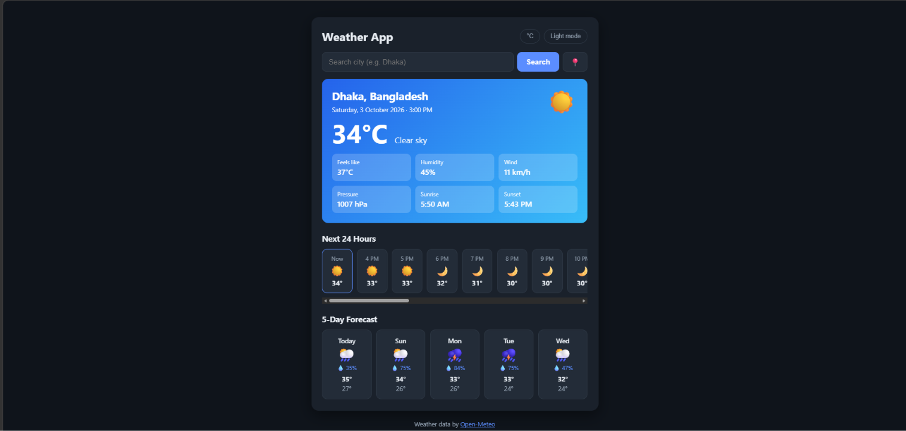

# Weather App

A clean and responsive weather app built with HTML, CSS and vanilla JavaScript. Search any city in the world and get the current weather, a 24-hour forecast and a 5-day forecast. No API key needed.

**Live demo:** https://iftakheremon.github.io/weather-app/



## Features

- Search weather by city name
- Use my current location (geolocation)
- Current temperature, feels like, humidity, wind, pressure, sunrise and sunset
- Next 24 hours forecast (scrollable)
- 5-day forecast with chance of rain
- Card background changes with the weather (clear, cloudy, rain, snow, storm, fog, day and night)
- Switch between °C / °F (wind switches between km/h and mph)
- Dark and light mode (remembers your choice)
- Recent searches and last searched city saved with localStorage
- Loading state and friendly error messages
- Responsive design for mobile and desktop

## Built With

- HTML5
- CSS3 (Flexbox, Grid, CSS variables, media queries)
- JavaScript (ES6, async/await, Fetch API, Geolocation API, localStorage)
- [Open-Meteo API](https://open-meteo.com/) (Geocoding and Forecast, free, no API key)

## Project Structure

```
weather-app/
├── index.html
├── css/
│   └── style.css
├── js/
│   └── script.js
├── screenshots/
│   └── preview.png
└── README.md
```

## How to Run Locally

1. Clone the repository
```bash
   git clone https://github.com/IftakherEmon/weather-app.git
```
2. Open the folder
```bash
   cd weather-app
```
3. Open `index.html` in your browser (or use the VS Code Live Server extension)

Note: the "use my location" button only works on `https://` or `localhost`, not when opening the file directly.

## What I Learned

- Fetching data from a public REST API with async/await
- Handling loading, error and empty states
- Working with JSON, dates and unit conversion
- Using the Geolocation API
- Saving user settings with localStorage

## Future Improvements

- City suggestions while typing
- Air quality and UV index
- Weather charts for temperature trends

## Credits

Weather data provided by [Open-Meteo](https://open-meteo.com/).

## Author

**Iftakher Emon**
GitHub: [@IftakherEmon](https://github.com/IftakherEmon)
